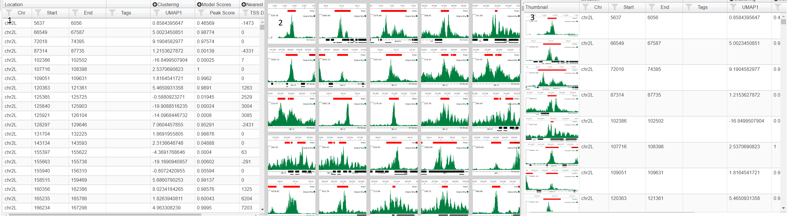

.. |expand| raw:: html

   <i class='fas fa-plus-circle'></i>

.. |zegami| raw:: html

   

.. |clone| raw:: html

   <i class='fas fa-clone'></i>

.. |download| raw:: html

   <i class='fas fa-download'></i>

.. |history_icon| raw:: html

   <i class='fas fa-history'></i>

.. |question| raw:: html

   <i class='fas fa-question'></i>

.. |tss_icon| raw:: html

   <i class='fas fa-exchange-alt'></i>

.. |stream| raw:: html

   <i class='fas fa-stream'></i>

.. |sort_up| raw:: html

   <i class='fas fa-sort-alpha-up'></i>

.. |color_palette| raw:: html

   <i class='fas fa-palette'></i>

.. |save| raw:: html

   <i class='fas fa-save'></i>

.. |camera| raw:: html

   <i class='fas fa-camera-retro'></i>

.. |cog| raw:: html

   <i class='fas fa-cog'></i>

.. |filter| raw:: html

   <i class='fas fa-filter'></i>

.. |table| raw:: html

   <i class='fas fa-table'></i>

.. |tags| raw:: html

   <i class='fas fa-tags'></i>

.. |images| raw:: html

   <i class='far fa-images'></i>

.. |call_peaks| raw:: html

   <i class='fas fa-signature'></i>

.. |share_icon| raw:: html

   <i class='fas fa-share'></i>

.. |cluster| raw:: html

   <i class='fab fa-cloudsmith'></i>

.. _multi-locus-view:

Multi Locus View
#########################

Summary
===================

Multi Locus View (MLV) enables the user to visually inspect the underlying data from NGS experiments e.g. RNA-seq, ChIP-seq. 
Initially, the user uploads a list of genomic locations and associated data (`Uploading a File`_), which can then intuitively filtered, sorted and viewed to drill down to regions of interest. 

.. image:: img/multi_locus_view.png
   :alt: alternate text
   :align: center

The view is divided into three sections. The top left shows charts (1), the bottom left a simple genome browser (2) and the right section shows a table containing all the genomic locations (3). Initially no charts are present and the browser only shows a track of the uploaded genomic regions (and possibly a RefGene track if a genome was selected). In order to make it easier to view and filter your data you can add charts (`Adding Graphs/Charts`_) and browser tracks (`Adding Tracks`_) . In addition analysis jobs such as finding intersections,  claculating signal at each location from a bigWig track and dimension reduction can be carried out (`Running Analysis Jobs`). 
Locations can be annotated (`Tagging Locations`_) by the user and downloaded or exported to the data visualisation tool `Zegami <http://www.zegami.com>`_

Creating a Project
===================

.. image:: img/create_mlv.png
   :alt: alternate text
   :align: center

To create a project click on 'My Projects' (1) on the top navigation bar and then the  Multi Locus View panel (2). This will take you to a page where you have to fill in the name and description of the project (3). You also have to select the gemome required. If the genome you want is not available select 'other'. In this case gene information and other annotations will not be available. When you press 'Create' you wll be taken to a page where you can upload your file (see below)

Uploading Data
----------------

Input File Required
++++++++++++++++++++++++
The file format is quite flexible and can be either tab(.tsv) or comma(.csv) delmited and can also be gzipped (.gz).
The only requirement is that the first three columns (in order) specify the genomic location i.e. chromosome, start and finish.
Normal bed files fulfill these criteria as well as excel data that has been saved as a .csv or .tsv file.
 
Other file types apart from bed-like files are not supported in the initial upload but
can be added later to the browser (see `Adding Tracks`_). In addition, in subsequent analysis bigWig files can be uploaded in
order to calculate peak stats at each genomic location (see `Calculate Peak Stats`_)

Chromosome names can either be the UCSC e.g. chr1, chr2, chrX etc or Ensembl style 1,2,X. However, if subsequent tracks are added
to the browser or biWig files are used to calculate peak stats, they have to be of the same format as the initial upload. 
This is not the case for calculating intersections, where you can mix and match between projects/annotation sets with Ensembl and UCSC style chromosome names.

Uploading a File
+++++++++++++++++++++

.. image:: img/upload_dialog.png
   :alt: alternate text
   :align: center

Press Choose in the displayed dialog and  select your file containing genomic locations. 
The file will be parsed and the column (feild) types will be ascertained and displayed. 
Ensure the correct datatype has been deduced and change if necessary using the dropdowns (2). 
The header names are taken from the file (1), but you can change these and you can also delete any columns that you do not want (3). 
If no headers were detected in the file, enter the name of the column - the value of the first row is given to help you (1). 
If the file contains a header, but it was not detected, check the Has Headers box (4) at the the bottom of the dialog.

Once you are satisfied, press the upload button. There will be a delay as the data is uploaded and processed and if there are no problems 
you will be presented with an initial view 

Saving A Project
----------------
When tracks, graphs or columns  are added and you have edit permissions (see `Permissions`_), they are permanantly added to the project. 
Also, when an analysis job has completed, any graphs,tracks or columns produced will be permanant. However, when you alter a graph or
tracks's settings or reize/move them, these are not saved. Similary any changes you make to the table (column resizing/ordering, sorting etc.)
will not automatically be saved. In order to save these changes you need to save the layout  |save| > Save Layout.

If you wish to make changes to public project then you will have to clone the project |save| > Save As. 
The project will be copied into your name and you can them make any changes you wish.

.. _mlv-view-data:

Adding Graphs/Charts
=====================

Charts help you get a picture of the data as a whole and also help you filter the data. 
By selecting regions (dragging with th mouse) on scatter plots and histograms or clicking on sections in pie charts, row charts and box plots, the data can be intutitively filtered. 
With each filtering step, all charts will update (as well as the table and browser) to reflect the filtered data. 
Filters on individual charts can be removed by clicking the reset button which appears on the chart's title bar when a filter is applied or filters on all charts can be removed with the 'Reset All' button. 

Charts can be moved by dragging on the title bar, and resized by dragging on the resize icon, which appears in the bottom right hand corner of chart when you hover over a chart. 

Initially the only chart visible will be a row chart showing Tags (see `Tagging Locations`_) so you need to add other charts to get a better insight into your data (see below)

.. _mlv-adding-a-chart:

Adding a Chart
----------------

Clicking on the 'Add Chart' button will show a dialog where you have to select the type of chart, the fields to use in the chart and its name. Once created you can change the chart's settings (|cog| icon), which differ according to the chart's type and with some charts color it (|color_palette| icon). Charts can moved by dragging them via the title bar and resized by the resize icon which appears in bottom left hand corner when the mouse is over the chart. The chart can be removed by clicking the trash icon, which appears when you hover over the graph's title. Once charts have been added and the appropriate settings/colors added, they can be saved using the |save| icon above the table. The following chart types are available

.. _mlv-scatter-plot:

Scatter Plot
+++++++++++++++++

.. image:: img/scatter_plot.png
   :alt: alternate text
   :align: center

A standard scatter plot requiring numerical fields for the x and y axis. Once created, the points can be coloured (|color_palette| on the title bar). Also by opening up the settings dialog (|cog| icon) you can alter the point size (3). By default the graph will show all the points, but you can zoom in and out using the mouse wheel and pan by pressing shift and dragging with the mouse. However if you want the default view to be a particular region, you can set this using the inputs in the Main Region section (4)and pressing show. The x and/or y axis can also be set to a log scale (5). After zooming and panning, the Centre Plot button (6) will restore the plot to show all the points or the region specified in (4). Normal mouse dragging (without shift) will cause pruduce a brush that filters the data, once created the brus can be dragged to different regions of the plot.  

Histogram
+++++++++++++++

Shows the distribution of a numerical field in the data. The x range is automatically set to include the largest and smallest values. However, this will often lead to the chart looking skewed due to low numbers of extreme outliers. Therefore, you can use the cog icon |cog| (1) to open up the settings dialog, where an upper and/or lower limit can be set (3). Values higher or lower than these limits will be lumped together in the outermost bin (4). The y axis can also be capped (5) in order to get a better handle on bins conatining fewer counts. The number of bins can be adjusted using the appropriate spinner(6). Each bar can be coloured by categorical data use the |color_palette| icon (2). 

Pie Chart
+++++++++++++
Shows categorical data. By default the maximium number of categories shown are the 8 largest ones, any reamining categories are lumped into 'Others'. This can be changed by opening up the settings dialog (|cog|). Clicking on a segment (category) will select that category and clicking on further segements will add these to the filter. To filter again with a single category, use the reset button.

Row Chart
+++++++++++++
A chart showing categories on the y axis and usually the number of records belonging to this category on the y axis. You can also choose a numerical field for the x axis, in which case the values of this field will be summed for each category. However a boxplot is usually more informative for this kind of information as the average and quartile ranges of the values are shown instead of the sum. As with the pie chart, the maximium number of categories shown are the 8 the largest ones, but this can be changed by opening up the settings dialog (|cog|)

BoxPlot
++++++++++
A chart showing categeories and average/quartile ranges of the values of another field for that category. Box plots work best for fields that contain only a small number of categories. They are scaled to include all the datapoints, so if there are extreme outliers, the boxes will appear squashed.

Bar Chart
++++++++++
A Bar Chart showing the column average of any number of supplied fields. Because fields may differ in scale,to ensure differing values can fit on the same scale, the average is scaled between the median +/- 1.5*IQR (the same as the whiskers on a boxplot). 
The graph changes to only include those datapints in the current filter. No Selection is possible with this chart, as it would make no sense to filter on a column 

The Genome Browser
====================

.. image:: img/browser.png
   :alt: alternate text
   :align: center

The browser shows the genomic location of the currently selected table row (or image). The distance either side of the region to also show can be controlld using the margin spinner (1)  above the browser

.. _mlv-adding-tracks:

Adding Tracks
-------------

Initially only two tracks will be displayed, the genomic locations you uploaded and if you didn't select 'other' for the genome, a track is displaying the genes. Other tracks can be added with the  'Add Tracks' button (2), which shows a dialog where you need to enter the url of a publically accessible track. The hosting server of the track should allow Cross Origin Resource Sharing (CORS). The type of track will try and be ascertained based on the url, although you can manually overide this by clicking on one of the radio buttons

Tracks that can be added are:-

* bed(tabix) - A bed file that has been gzipped and indexed with tabix
* BigBed 
* BigWig
* Bam - A bam index is also required
* UCSC session - either cut and paste the url from the UCSC browser or use a session url. The latter will be more stable as the former uses a temporary id, which is only valid for a short period.

Altering Track Appearance
----------------------------

Clicking on the track label in the legend (3) will open a dialog for that track. The contents of the dialog will vary
according to the type of track. The track height can be altered from this dialog

Zooming/Panning
------------------------

There are five ways you can navigate using the browser:-

   * You can zoom in and out using the mouse wheel and scroll left and right by deagging the mouse
   * Use shift and drag to highlight and zoom into a region on the browser
   * Use the magnifying glass icons (4), the zoom amount can be controlled by the adjacent spinner (5)
   * Type the location co-ordinates (chr:<start>-<stop>) in the location text box (6)
   * Click on a row or image in the right hand table to go to that feature. The margin spinner (1) shows how many bp  either side of the feature will be displayed. 

Feature track
-------------------
This shows the uploaded regions(features) displayed in the right hand table. Clicking on the settings |cog| icon (7) will bring up a dialog where the following can be adjsuted:-

    * Set the field you wish to a label the features with
    * Set the field to color the feature by
    * Set the field with which to position the feature on the y axis. By default the feature layout depends on the layout (Collapsed, expanded or squished)
      but can be a numeric field 
    * Choose the margins (distance either side of the feature) that will be displayed when you click on an image or a row in thr table

Saving the Browser Layout
-----------------------------------
Use the disk icon |save| above the the table to save all settings including the current layout of the browser (tracks and track settings)

Capturing An Image
---------------------------
Use the |camera| icon (9) to download an image of the current browser view. The image format (png, pdf or svg) can altered using the adjacent dropdown (10)

The Table/Images
===================
The default table behaves as a typical spread sheet, you can alter the column width by dragging the header's left and right borders and move columns by dragging the column's header. Clicking on the header will sort by that column. Clicking on that row will select it and update the browser.

Table Mode
----------------

If your project contains images (see `Adding Images`_) then then you change how the table is displayed using the table icon (|table|). Three choices are table (1), images (2) and table with thumbnials (3).In image mode, the genomic location can be selected by clicking on the image and using the arrow keys to select the next/previous image. In this mode, the data can be sorted and filtered using the icons (|filter| |sort_up|) in the menu above the table.
Also in image mode you can alter image size using the slider in the table menu and also color the border around the image by a field (|color_palette|). This opens up a dialog where you can choose the field and the color scale to use

Filtering Data
----------------------
It is often more intuitive to filter using graphs (see `Adding Graphs/Charts`_ ), however data can be filtered by clicking on filter icon |filter| in each column header. To filter on multiple columns or when the table is only showing images,press the filter icon on the top table menu. This will bring up a dialog showing filtering options for all fields in the data. Whenever any filters are added or changed, any charts will update accordingly,but the filters are not added to the charts or existing filters on the charts updated as they are completely independant.

Sorting Data
-----------------
The data  can be sorted on columns by clicking the column header (shift click to sort on multiple columns). The data can be also be filtered by clcking the sort icon |sort_up| in the table menu. In the sort dialog,the columns to be sorted on are added usng the plus icon and then either Ascending (ASC) or descending (DESC) can be chosen . The sort order can be changed by dragging the labels or columns removed from the sort by clicking on the trash icon

.. _mlv-tagging-locations:

Tagging Locations
====================

.. image:: img/tagging.png
   :alt: alternate text
   :align: center

Sometimes it may be useful to catgeorise or tag the genomic location based on a trend theat that you have discovered. This can be done by opening up the tagging dialog with tag icon |tags| (1) in the menu above the table. Initially only the none category is present. To add other ones type a name in the text box (2) and press the add button (3) . The category will then be added to the list at the top of the dialog. By selecting the radio button next to it, then clicking on an image or a cell in the tagging column in the table will tag that genomic location. Multiple locations can be tagged by clicking and image/cell and the shift clicking another one and all the images/rows in between will be tagged. The 'Tag All' will tag all the currently filtered locations with the currently selected catogry. Another way to tag is to use the arrow keys to go to the next previous image/row and then press the shortcut key shown in brackets next to the category to tag the currently selected items with that category. The category color can be changed by clicking on the appropriate color chooser (7). The category can be removed (which will remove all tags of this category from the data using the trash icon next to the category (8)

*N.B.* To permanantly save the tags press the Save button (5) which will commit the changes to the database.

.. _mlv-adding-images:

Adding Images
=====================

Images for every genomic location can be added to the project and then displayed in the table. The |images| icon (1) opens up a dialog where you can choose to either have images created based on the internal browser (2) or by the UCSC browser (3). with the USCS option, you can have more detailed images, but is image generation is much slower and you are limited in the number of images you can create. One option is to create a smaller subset (see `Creating Subsets`_  and then produce images from this.
 
MLV Images
----------------
Clicking on the Preview button (4) will show a preview of the image for the currently selected row (5). The image is based on the tracks and settings in the browser (6) see `The Genome Browser`_ on how to add tracks and alter their appearance. You can adjust the image width and the width of margins shown either side of the genomic location by using the apprpriate spinners (7 and 8). Once you are happy with image you can press submit button (9) and images for all genomic locations will be created. This will take a few minutes (approx 800 images/min). 

UCSC Images
-------------------
Clicking on the UCSC radio (3) will enable the the URL input (9) where you can paste a UCSC browser URL or session. Pressing preview will check the url is valid and produce an image based ob the margin width (7), image width(8) and selected gemomic location (5). If a preview was sucessfuly produced then you can press the submit button (9) to generate images for all genomic locations. This will take quite a while.

An email will be sent when all images have been generated. You can then view the table in image or thumbnail mode (see `Table Mode`_) and upload the project to Zegami

Running Analysis Jobs
======================
Analysis jobs are run in the background on the server and the results, in the form of tracks, graphs and extra columns in the table are added to the project once the job is complete. 
The following types of analysis are possible:-

* |stream| **Annotation Intersection** - calculates whether each location overlaps a set of annotations or locations from another project.
* |tss_icon| **Find TSS Distances** - calculates whether each location overlaps a Transcription Start Site (TSS) and if not, the distance to nearest site, either upstream (+) or downstream (-).
* |call_peaks| **Calculate Peak Stats** - calculates the area and max height of the signal from a bigWig file at at each location in the project.
* |cluster| **Cluster on Columns** - carries out dimension reduction (UMAP,tSNE) on any number of given columns in the project. 

Jobs are run in the background and can be viewed on thr 'My Jobs' page (link in the top navigation bar) or in the history dialog (|history_icon|), which will automatically open when you send a job. 
You do not need to stay on the page whilst jobs are running, although if you do when the job is finished, you will be notified and the appropriate results loaded in.

Annotation Intersection
--------------------------

Intersections can be carried out between an Annotation Set, which us basically just a list of genomic locations, or another project. 
In the simplest case, a single column will be added, with TRUE/FALSE values, depending on whether a region in your project overlaps with a region in the query set.

Annotation Sets
++++++++++++++++++

Annotation sets are just lists of genome locations and can be created by clicking on 'Annotations' in the upper panel of my projects page, which will open up the following page:-

.. image:: img/annotation_set.png
   :alt: alternate text
   :align: center

Fill in the name, description and genome in the right hand panel (1), then press next (2). A dialog will open (3), which allows you to upload a bed like file (see `Uploading a File`_). 
In the left hand panel (4) is a list of all the  annotation sets that you own.  You can make these public (5), share (6) or delete them (7).

Another way to create an annotation set is within a project, |stream| > create annotation set. 
**N.B.** The set will be created from the currently selected (filtered locations), shown the top right hand corner.
Again, the dialog allows you to fill in the name and description of the set and you can also check any columns that you want included in the set.

Intersections
+++++++++++++++++

|stream| > 'Annotation Intersection' will being up a table with all the Annotation Sets and projects that you are able to inteserct with. 
You can select single or multiple (ctrl or shift) sets/projects. If you select a single project/set then a dialog will ask you whether you 
want just a TRUE/FALSE column or whether you want extra columns, with information from the intersecting set.

Once an annotation set has run, columns will be added to the table, either a single TRUE/FALSE column for each intersecting set or the data columns you selected in the previous step. 
In addition,  pie charts showing this TRUE/FALSE distribution will be added, along with a track for each intesecting set.

Find TSS Distances
---------------------

|tss_icon| will bring up a simple dialog, with the only choice being whether you want to include Gene Ontolgy annotations. 
These are taken from the go-basic.obo file (`<http://geneontology.org/>`_) and collpsed, such there is only one term (the most frequent) at each hierarchical level.
If you include GO annotations, you can choose upto which hierarchical level you want.

Once the job has run four columns will be added to the table

    * TSS distance -  the distance to the nearset TSS, + being upstream and - downstream
    * Gene ID - the Genbank gene id of the nearest gene
    * Gene Name - the common name of the nearest gene
    * Ovelaps TSS - either TRUE or FALSE depending on whether the region overlaps the TSS

Cluster on Columns 
-------------------
In order to get a better handle on the data it may be useful to collapse some of the fields into two (or more) dimensions, such that they can
be visually clustered in a 2D scatter plot.
To do this click on the cluster icon (|cluster|) above the table, which brings up the dialog below.

.. image:: img/cluster_dialog.png
   :alt: alternate text
   :align: center

Type a name in the text box (1) and select the dimension reduction methods required (2). 
The number of dimensions can also be increased (default 2) using the dropdown (3). 
All numerical fields in the analysis are displayed (4), check all the ones to be used in the analysis and then press submit (5).

The outputs are columns for each dimension for each method named '<method><number>_<anlysis_name>' e.g tSNE1_anal1,  tSNE2_anal1 etc.
For each method, a scatterplot of the first two dimensions will be also be added. You can change these scatter plot e.g color by a specific field (see `Scatter Plot`_) or use the dimensions to add another graph (see `Adding a Chart`_)  

Calculate Peak Stats
-------------------------

If you have bigWig files and you want to find out the peak area/height in each of the genomic locations in your project, 
use the  |call_peaks| icon which brings up the dialog below.

.. image:: img/peak_stats.png
   :alt: alternate text
   :align: center

Paste the url (or a list of urls) corresposnding to bigwig files you want to analayse in the text box (1) and press Add (2).
If the bigWig files can be located and they are the correct format, they will be added to the "bigWig Tracks to Process" section (3)in the dialog.
The name is taken from the file name, but this can be changed. When you have specified all the bigWig files required, press submit
The area, max height, width and density (area/width) in each location will be calulated. You do not have to stay on the page whilst the stats are being calculated. 

When complete, columns will be added to the table with the relevent information and each bigWig track will be added to the Browser.
The bigWig tracks are added with default settings, so you may need to change them to suit your needs (see `Altering Track Appearance_`). 
Note it just calculates the amount of signal in each region and reports the width of the region, it does not try and call peaks and work out the the width of the peak.
 

Creating Subsets
=================

Clicking on |clone| brings up a dialog, which allows you to create a subset of the currently selected locations

You can choose to create the subset either from the currently filtered locations (1) or from a random subset (2) with a specified number (3). 
After filling in a name and description (4) and (5), press 'Create' and the subset will be created. 
Once this has happened, you will get a link to the subset. You can create a susbset of any project you have viewing rights too, including public projects, and you will 
be the owner of the subset. All graphs/tracks/columns are copied, although the graphs may look different as there will be fewer locations in the new project.
 

Exporting Data
===============

Click on the download icon |download| to download the currently filtered locatons. The data is just downloaded as a text file, 
although you get a choice to download in either tsv or csv format. 
Only the currently displayed columns will be downloaded, so expand any column groups by clicking the plus icon |expand| if you want these in your file. 
If you have images in your project, you can export the data to `Zegami <http://www.zegami.com>`_. Click on the Zegami icon |zegami| and a dialog will appear, 
wher you have to fill in your zegami username, project id and password. Once the project is created, you will emailed a link to the project 

Project History
===================

Every action such as adding a graph/track/column is recorded and be viewed by opening the history dialog (|history_icon|)

Clicking on the eye icon (1) will toggle information about the action. The second icon (2) shows the status of the action, a tick means it is complete, a spinning circle shows that it is still processing an an exclamation mark showd there was an error whilts trying to perform the action. If you have edit permissions you are able to undo the action (N.B. there is no redo action). This will remove the action from the dialog and remove any tracks,columns or graphs that the action generated. If columns are removed, than any graphs which use these columns will also be removed, even if they were not added by the action.

Permissions
============
There are two types of permission for a project, view and edit. 

If you have a view permission for a project (anyone has view permission for a public project), you can open the project and add tracks and charts, as well as edit existing charts and tracks. However, you cannot save any updates or run any jobs such as finding TSS's or creating images.
If you want to do this, you will have to copy the project (you need to be logged in) - click the  disk icon (|save|)  and then select 'save as'. 
This will clone the project in your name and then you can make any changes you wish.

If you have editing rights to a project you can make any changes you want , run any jobs and save the layout |save| . You automatically have editing rights to a project you own it or if you are an adminisrator.  You can also be assigened editing rights to a project (see below)

The |share_icon| icon on the menu allows you to share the project with another user and assign them view or editing rights 

Sharing a Project
-----------------

Click on share icon (|share_icon|) above the table and select 'share project' 

Start typing the name of user you want to share the project with in the text box (1) and then select the name from the drop down.
When you press 'Add' (2), the project will be shared and the name of the user will be added to the dialog (3). You can change the editing rights of the user to view or edit using the dropdown (4) or stop sharing by pressing the trash icon (5)

Making a Project Public
------------------------

Click on share icon (|share_icon|) above the table and select 'share project', you will be prompted to see whether you really want the 
project to become public. If you click OK then then anyone (including non users) will be able to view the project. You can share the project by sharing the link in the browser's address bar.

Submitting an Issue
====================

An Issue or question, can be asked within MLV (if you are logged in) using the help link  in the top navigation bar |question|  > 'Send Question'.
You can also submit an issue to he `GitHub page <https://github.com/Hughes-Genome-Group/mlv/issues>`_

Frequently Asked Questions
============================

Can MLV be viewed on a mobile/small screen device?
---------------------------------------------------

No. The whole idea is to see how each component ie. the graphs,tracks and images change as you filter the data, which would not be possible,
if only one component was displayed at once. 
All panels and individual tracks/graphs/table columns/images can be resized, to get the exact layout that the user requires, rather than relying on adapative screen size techniques which limit viewing to a single compnent/panel on small screen sizes

Can I upload a bigWig file?
----------------------------

Not initially. The only files that can be initially uplaoded are bed or bed like files with genomic locations. 
However, bigWig files can be added to the browser and uplaoded for processing later (see `Calculate Peak Stats`_).
Another application, `Lanceotron <https://lanceotron.molbiol.ox.ac.uk/>`_ does take bigWig files and identifies peaks based on machine learning.

